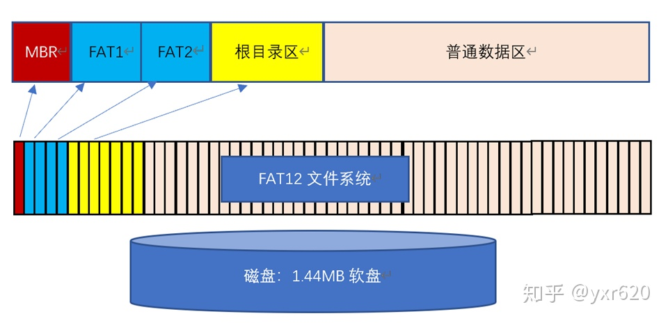
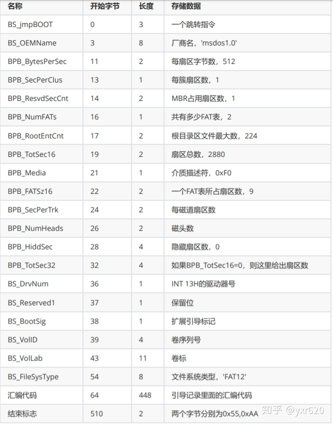

# FAT12文件系统介绍

## 简介

FAT12文件系统是指：在磁盘上规定一种特定的存储格式，这种存储格式高效方便，功能强大，因此形成了统一的规定。

## 基础知识

具体来说FAT12文件系统为1.44M的**软盘**设计。1.44M的软盘有2880个扇区，一个扇区有512个字节；那么FAT12文件系统的管理的空间大小就是2880 * 512 = 1474560个字节

实际的扇区是在磁盘上，但是我们可以把所有的储存空间看作是一个很大的数组，把扇区当作是连续排列的。扇区当作数组看待时，称为逻辑扇区，从0开始编号。

## FAT12基础结构

首先FAT12文件系统将2880个扇区分成5个部分：MBR引导记录、FAT1表、FAT2表、根目录、数据区

## MBR引导记录

严格来说, 软盘第一个扇区应该称为引导扇区（Boot Sector）, 而非MBR, 但是常常混用

MBR引导记录有512个字节，最后两个字节是0x55和0xAA；MBR记录的所有信息如下（储存数据附上常用值；部分数据没有给出）

MBR引导记录就是BOIS读入内存的一个扇区，可以看到第一条指令就是汇编语言x86中的跳转指令，这条指令将跳转到后面的汇编代码区域进行执行。由于我们在做模拟FAT12文件系统程序时不需要考虑后面一段代码，因此后面的汇编代码通常为0。