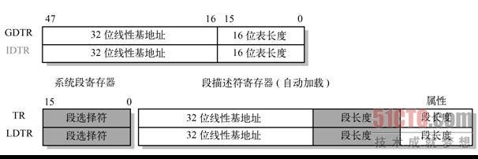

一、内存管理寄存器

处理器提供了4个内存管理寄存器（GDTR、LDTR、IDTR和TR），用于指定内存分段管理所用系统表的基地址，如图4-2所示。处理器为这些寄存器的加载和保存提供了特定的指令。有关系统表的作用请参见4.2节"保护模式内存管理"中的详细说明。

GDTR、LDTR、IDTR和TR都是段基址寄存器，这些段中含有分段机制的重要信息表。GDTR、IDTR和LDTR用于寻址存放描述符表的段。TR用于寻址一个特殊的任务状态段（Task State Segment，TSS）。TSS中包含着当前执行任务的重要信息。

（1）全局描述符表寄存器GDTR

GDTR寄存器中用于存放全局描述符表GDT的32位的线性基地址和16位的表限长值。基地址指定GDT表中字节0在线性地址空间中的地址，表长度指明GDT表的字节长度值。指令LGDT和SGDT分别用于加载和保存GDTR寄存器的内容。在机器刚加电或处理器复位后，基地址被默认地设置为0，而长度值被设置成0xFFFF。在保护模式初始化过程中必须给GDTR加载一个新值。

（2）中断描述符表寄存器IDTR

与GDTR的作用类似，IDTR寄存器用于存放中断描述符表IDT的32位线性基地址和16位表长度值。指令LIDT和SIDT分别用于加载和保存IDTR寄存器的内容。在机器刚加电或处理器复位后，基地址被默认地设置为0，而长度值被设置成0xFFFF。

（3）局部描述符表寄存器LDTR

LDTR寄存器中用于存放局部描述符表LDT的32位线性基地址、16位段限长和描述符属性值。指令LLDT和SLDT分别用于加载和保存LDTR寄存器的段描述符部分。包含LDT表的段必须在GDT表中有一个段描述符项。当使用LLDT指令把含有LDT表段的选择符加载进LDTR时，LDT段描述符的段基地址、段限长度以及描述符属性会被自动地加载到LDTR中。当进行任务切换时，处理器会把新任务LDT的段选择符和段描述符自动地加载进LDTR中。在机器加电或处理器复位后，段选择符和基地址被默认地设置为0，而段长度被设置成0xFFFF。

（4）任务寄存器TR

TR寄存器用于存放当前任务TSS段的16位段选择符、32位基地址、16位段长度和描述符属性值。它引用GDT表中的一个TSS类型的描述符。指令LTR和STR分别用于加载和保存TR寄存器的段选择符部分。当使用LTR指令把选择符加载进任务寄存器时，TSS描述符中的段基地址、段限长度以及描述符属性会被自动加载到任务寄存器中。当执行任务切换时，处理器会把新任务的TSS的段选择符和段描述符自动加载进任务寄存器TR中。